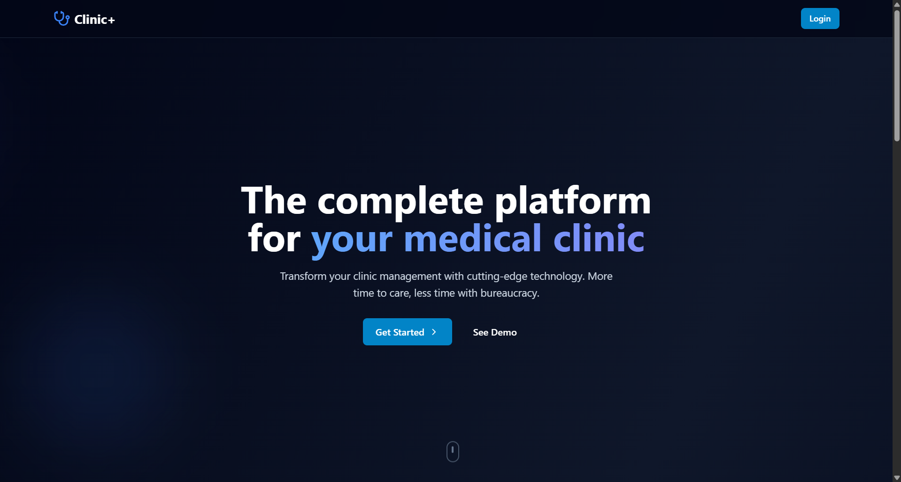
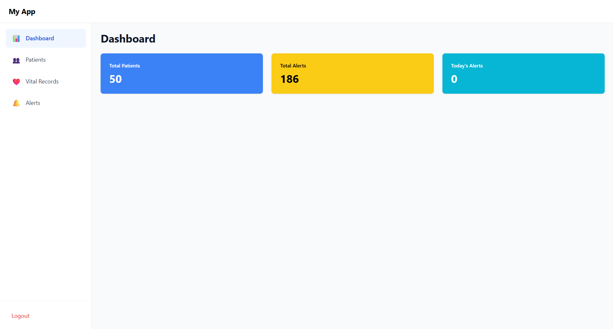

# 🏥 Clinic --- Full Application

A clinical management system running entirely through **Docker
Compose**, with:

- **React + TypeScript** (Frontend)
- **Django REST Framework + PostgreSQL** (Backend)

Both the **backend and frontend are started only through Docker** --- no
manual npm / pip steps required.

---

## 📖 About the Project

The **Clinic Platform** provides tools for:

- Patient management
- Vital signs records
- Automated alerts
- JWT authentication
- Admin and staff operations
- Modern responsive UI

Everything is containerized to ensure consistent development and
deployment.

---

## 💻 Technologies

### Frontend

- React 18
- TypeScript
- Vite (inside container)
- Nginx

### Backend

- Python 3.11
- Django 5
- Django REST Framework
- SimpleJWT
- PostgreSQL
- Gunicorn
- Docker & Docker Compose
- drf-spectacular (Swagger)

---

# 🚀 Getting Started (Docker Compose)

All commands must be executed **in the root folder**, where the file
below is located:

    clinica/docker-compose.yml

### 1. Start all services

```bash
docker-compose up -d --build
```

This launches:

| Service      | URL                                       |
| ------------ | ----------------------------------------- |
| Frontend     | http://localhost:3000                     |
| Backend API  | http://localhost:8000                     |
| Swagger Docs | http://localhost:8000/api/schema/swagger/ |

---

### 2. Apply migrations

```bash
docker-compose exec backend python manage.py migrate
```

### 3. Seed initial data (optional)

```bash
docker-compose exec backend python manage.py seed_initial_data
```

---

# 🔧 Useful Commands

### Create migrations

```bash
docker-compose exec backend python manage.py makemigrations
```

### Reset everything (database + containers)

```bash
docker-compose down -v
docker-compose up -d --build
docker-compose exec backend python manage.py migrate
```

---

Initial Page



Dashboard

## 

Patients page


# 📚 API Documentation

- Swagger UI → `http://localhost:8000/api/schema/swagger/`
- OpenAPI JSON → `http://localhost:8000/api/schema/`

---

## Links

- Link: https://clinica-mauve-omega.vercel.app/
- Repository: https://github.com/GiseleBCSantos/clinica

# 📌 Versioning

**1.0.0**

---

# 👩‍💻 Author

**Gisele Santos**\
Full Stack Developer

Thanks for visiting and happy coding! 🚀
